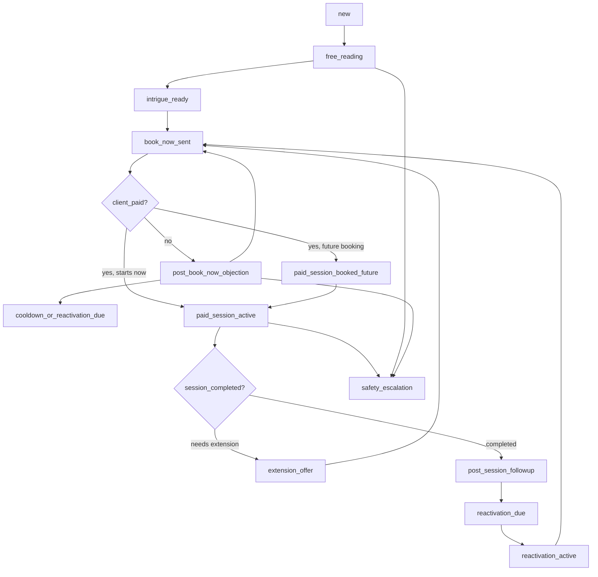

# Conversation State Machine для Confideline Admin Workspace

Документ переводит выводы из видеоанализа конкурента в формальную модель состояний диалога. Это не описание текущей реализации Confideline, а целевая продуктовая логика, которую стоит использовать при развитии `admin-chat-workspace-v2`.

Основа: `INSIGHTORBA_COMPETITOR_WORKFLOW_FULL_DOCUMENTATION_RU.md`, разделы 5, 6, 9 и 10.

## 1. Главный принцип

Диалог нельзя хранить только как список сообщений и визуальные теги. У него должна быть явная бизнес-стадия, потому что от нее зависят:

- доступные действия эксперта;
- подсказки composer;
- риск бесплатного раскрытия платной ценности;
- очереди `Active chats` и `Pings`;
- правила Book Now;
- paid-session timer;
- objection handling;
- reactivation/lift;
- safety escalation.

## 2. Высокоуровневый lifecycle



## 3. Список целевых стадий

| Stage | Смысл | Основная цель |
|---|---|---|
| `new` | Новый или только что назначенный диалог | Быстро понять контекст, историю и право эксперта брать чат |
| `free_reading` | Бесплатная первичная работа | Дать ограниченную ценность и собрать данные |
| `intrigue_ready` | Ценность создана, пора вести к покупке | Сформулировать причину купить сессию |
| `book_now_sent` | Кнопка/CTA отправлены | Не раскрывать больше платный ответ, ждать оплаты или возражения |
| `post_book_now_objection` | Клиент отвечает после Book Now без оплаты | Обработать возражение и вернуть к покупке |
| `paid_session_booked_future` | Сессия куплена, но еще не началась | Удерживать клиента, не выдавая контент будущей сессии |
| `paid_session_active` | Оплаченная сессия идет сейчас | Выполнить обещанные темы, не молчать, управлять таймером |
| `extension_offer` | Нужна новая платная сессия / продление | Объяснить, что новые темы требуют нового времени |
| `post_session_followup` | Сессия завершена | Зафиксировать итоги, favorite/note, подготовить lift |
| `reactivation_due` | Наступило время поднятия | Поставить чат в follow-up/Pings |
| `reactivation_active` | Эксперт начал возвращать клиента | Дать причину возвращения, intrigue, Book Now |
| `cooldown_or_reactivation_due` | После исчерпания возражений | Остановить давление и вернуться позже |
| `closed_or_archived` | Чат не требует активного действия | Не мешать очереди |
| `safety_escalation` | Обнаружена тема риска | Приоритет safety над продажей |

## 4. Переходы

| From | Event | To | Условие / комментарий |
|---|---|---|---|
| `new` | `conversation_assigned` | `free_reading` | Чат назначен эксперту, нет активной покупки |
| `new` | `previous_buyer_detected` | `intrigue_ready` | Возвращающемуся платившему клиенту не нужен полный новый free reading |
| `free_reading` | `required_data_missing` | `free_reading` | Эксперт задает уточняющие вопросы |
| `free_reading` | `value_signal_delivered` | `intrigue_ready` | Дано достаточно ограниченной ценности |
| `free_reading` | `free_trial_expired` | `intrigue_ready` | Нужно обозначить границу и вести к оплате |
| `intrigue_ready` | `book_now_sent` | `book_now_sent` | Book Now становится центральным событием |
| `book_now_sent` | `client_message_without_payment` | `post_book_now_objection` | Любое сообщение после Book Now трактуется как явное или скрытое возражение |
| `post_book_now_objection` | `objection_answered` | `book_now_sent` | Эксперт возвращает клиента к покупке |
| `post_book_now_objection` | `attempt_limit_reached` | `cooldown_or_reactivation_due` | Лимит подтвержден как guideline, точное число 3 или 3-4 требует проверки |
| `book_now_sent` | `payment_completed_now` | `paid_session_active` | Сессия начинается сразу |
| `book_now_sent` | `payment_completed_future` | `paid_session_booked_future` | Контент будущей сессии нельзя раскрывать заранее |
| `paid_session_booked_future` | `session_start_time_reached` | `paid_session_active` | Включается timer и обязательства по темам |
| `paid_session_active` | `promised_topics_completed` | `post_session_followup` | Сессия закрыта качественно |
| `paid_session_active` | `new_topic_requested` | `extension_offer` | Новая тема требует нового оплаченного времени |
| `paid_session_active` | `operator_silent_too_long` | `paid_session_active` | Стадия не меняется, но растет refund/support risk |
| `post_session_followup` | `next_day_or_lift_time` | `reactivation_due` | Особенно для buyers и strong-intent clients |
| `reactivation_due` | `operator_starts_lift` | `reactivation_active` | Чат попадает в Pings/follow-up queue |
| `reactivation_active` | `book_now_sent` | `book_now_sent` | После lift не надо добавлять бесконечную новую интригу |
| `*` | `self_harm_or_sensitive_risk` | `safety_escalation` | Safety выше конверсии |
| `*` | `resolved_or_no_action` | `closed_or_archived` | Чат не должен шуметь в активной очереди |

## 5. События

События должны быть логируемыми, потому что по ним можно строить аналитику, QA и подсказки.

| Event | Payload | Где используется |
|---|---|---|
| `conversation_assigned` | `conversationId`, `operatorId`, `sourceQueue` | Очередь, ownership |
| `previous_buyer_detected` | `clientId`, `purchaseCount`, `lastPurchaseAt` | Free reading boundary, reactivation |
| `free_trial_started` | `remainingMessages`, `remainingSeconds` | Composer hints, right panel |
| `free_trial_expired` | `reason` | Boundary message, Book Now |
| `value_signal_delivered` | `insightCount`, `themes` | QA, conversion readiness |
| `intrigue_created` | `theme`, `specificity`, `revealsPaidContent` | QA, leakage prevention |
| `book_now_sent` | `buttonId`, `promisedTopics`, `couponAttached` | Transition event |
| `client_message_without_payment` | `messageId`, `detectedObjectionType` | Objection state |
| `objection_answered` | `type`, `attemptNumber`, `returnedToBookNow` | Attempt limit |
| `coupon_sent` | `couponCode`, `platform`, `eligibility` | Discount logic |
| `payment_completed` | `sessionId`, `startsAt`, `endsAt`, `duration` | Paid session state |
| `paid_session_started` | `sessionId`, `timerEndsAt` | Timer, Pings |
| `paid_session_message_sent` | `sessionId`, `messageId`, `secondsSincePrevious` | Refund risk |
| `paid_session_idle_risk` | `sessionId`, `idleSeconds`, `threshold` | Pings, QA |
| `paid_content_gating_warning` | `reason`, `futureSessionId` | Composer guard |
| `extension_offer_sent` | `reason`, `newTopics` | Revenue flow |
| `reactivation_scheduled` | `reason`, `nextActionAt` | Pings |
| `reactivation_started` | `reasonTemplate`, `clientHistoryBasis` | Lift workflow |
| `safety_flag_detected` | `category`, `confidence`, `messageId` | Escalation |
| `claim_precision_flagged` | `category`, `messageId` | Risk control |

## 6. Минимальная data model

```ts
type ConversationStage =
  | 'new'
  | 'free_reading'
  | 'intrigue_ready'
  | 'book_now_sent'
  | 'post_book_now_objection'
  | 'paid_session_booked_future'
  | 'paid_session_active'
  | 'extension_offer'
  | 'post_session_followup'
  | 'reactivation_due'
  | 'reactivation_active'
  | 'cooldown_or_reactivation_due'
  | 'closed_or_archived'
  | 'safety_escalation';

type ConversationWorkflowState = {
  stage: ConversationStage;
  stageChangedAt: string;
  assignedOperatorId?: string;
  sourceQueue: 'all' | 'active' | 'pings' | 'archive';
  bookNow?: BookNowState;
  freeTrial?: FreeTrialState;
  paidSession?: PaidSessionState;
  objection?: ObjectionState;
  reactivation?: ReactivationState;
  clientContinuity?: ClientContinuityState;
  safety?: SafetyState;
};
```

## 7. Queue mapping

| Stage | `All` | `Active chats` | `Pings` | Комментарий |
|---|---:|---:|---:|---|
| `new` | Да | Да, если назначен | Нет | Требует первого действия |
| `free_reading` | Да | Да | При idle risk | Активная работа |
| `intrigue_ready` | Да | Да | При overdue | Нужно вести к Book Now |
| `book_now_sent` | Да | Да | При клиентском ответе | Ожидание оплаты/возражения |
| `post_book_now_objection` | Да | Да | Да, если висит без ответа | Высокий приоритет |
| `paid_session_booked_future` | Да | Нет до старта | Да перед стартом | Не выдавать контент заранее |
| `paid_session_active` | Да | Да | Да при молчании/таймере | Максимальный приоритет |
| `extension_offer` | Да | Да | При клиентском ответе | Revenue continuation |
| `post_session_followup` | Да | Нет | Может быть scheduled | Подготовка lift |
| `reactivation_due` | Да | Нет | Да | Pings как follow-up queue |
| `reactivation_active` | Да | Да | Да | Эксперт уже начал lift |
| `cooldown_or_reactivation_due` | Да | Нет | В назначенное время | Не давить сразу |
| `closed_or_archived` | Да | Нет | Нет | История |
| `safety_escalation` | Да | Да | Да | Приоритет выше продаж |

## 8. Composer guardrails

| Stage | Подсказка / запрет |
|---|---|
| `free_reading` | Не закрывать весь запрос бесплатно; держать ответ ограниченным |
| `intrigue_ready` | Сформулировать конкретную intrigue, связанную с запросом |
| `book_now_sent` | Не добавлять новый бесплатный смысл; возвращать к покупке |
| `post_book_now_objection` | Классифицировать objection и считать попытки |
| `paid_session_booked_future` | Не раскрывать контент будущей сессии |
| `paid_session_active` | Следить за таймером, темами и частотой сообщений |
| `extension_offer` | Новые темы переводить в новое оплаченное время |
| `reactivation_active` | Дать причину возвращения, не плодить бесконечную интригу |
| `safety_escalation` | Остановить sales-flow, показать safety path |

## 9. Что считать подтвержденным

Высокая уверенность:

- Book Now является главным transition event.
- Paid session имеет отдельный контракт: timer, promised topics, message density, refund/support risk.
- Paid content gating нужен, особенно при future booking.
- Reactivation/lift является отдельным рабочим процессом.
- Pings можно использовать не только как уведомления, а как очередь follow-up/рисков.
- Safety и claim precision должны быть отдельными флагами.

Средняя уверенность:

- Точный лимит objection attempts: звучит как 3 или 3-4.
- Полный набор папок/источников в конкурентском кабинете.
- Точные backend-правила coupon eligibility.
- Точные формулы dashboard/statistics.

## 10. MVP внедрения

Первый слой:

1. Добавить `conversation.stage`.
2. Добавить события `book_now_sent`, `payment_completed`, `paid_session_started`, `reactivation_scheduled`.
3. Показать stage badge в списке чатов и right panel.
4. Добавить composer hints по стадиям.
5. Привязать `Pings` к `reactivation_due`, `paid_session_idle_risk`, `free_trial_expired`.

Второй слой:

1. Paid-session timer и promised topics.
2. Objection attempt counter.
3. Coupon eligibility panel.
4. Client continuity block: previous buyer, purchase history, previous experts, duplicate/new chat suspected.
5. Safety/claim flags.

Третий слой:

1. QA analytics по событиям.
2. Mentor dashboard.
3. Expert onboarding/workforce states.
4. Автоматическая reactivation scheduling.
