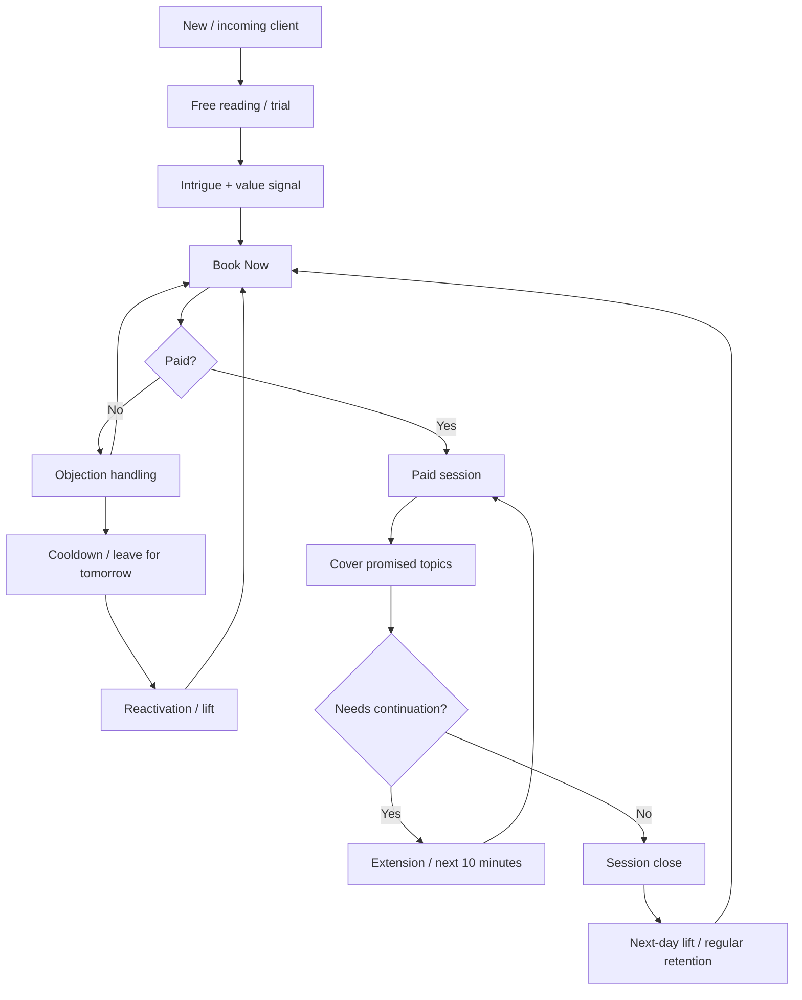

# InsightOrba / конкурентный кабинет: полная документация по видеоанализу

Дата подготовки: 2026-05-13

Репозиторий: `confideline`

Основание: серия обучающих видео конкурента, транскрибация аудио и анализ видеокадров интерфейса.

## 1. Назначение документа

Этот документ сводит результаты анализа 14 видеофрагментов за 7 учебных дней. Цель - дать аргументированную основу для продуктовых, регламентных и технических решений по Confideline: как должен быть устроен экспертный чат-кабинет, какие бизнес-процессы нужно поддержать, какие состояния должны храниться в данных, какие правила работы эксперта нужно встроить в интерфейс и QA.

Документ отделяет:
- подтвержденные наблюдения;
- уверенные выводы на основе нескольких видео;
- вероятные, но не полностью подтвержденные предположения;
- места, где транскрипт или видеокадры недостаточно ясны.

## 2. Источники и метод анализа

Обработано 14 видеофайлов, суммарная длительность примерно **47 часов 00 минут**.

Видео обработаны локально:
- `ffmpeg/ffprobe` - проверка параметров и извлечение кадров;
- faster-whisper - транскрибация аудио;
- покадровый скан - `frames_index.csv`, raw frames, contact sheets;
- ручная валидация - сопоставление транскрипта, таймкодов и видимого интерфейса.

Основные артефакты лежат в:

`C:\GPT-local\confideline\docs\video-analysis\`

По каждому видео создан отдельный analysis-док:

| Видео | Документ | Длительность | Основной вклад |
|---|---:|---:|---|
| Day 1 Part 1 | `day-1-part-1/INSIGHTORBA_DAY1_PART1_ANALYSIS.md` | 02:46:21 | Базовый кабинет, воронка, правила эксперта |
| Day 1 Part 2 | `day-1-part-2/INSIGHTORBA_DAY1_PART2_ANALYSIS.md` | 02:34:29 | Multi-avatar, Book Now, AI summary, профили |
| Day 2 Part 1 | `day-2-part-1/INSIGHTORBA_DAY2_PART1_ANALYSIS.md` | 02:45:39 | Trial/free reading, paid lifecycle, required data |
| Day 2 Part 2 | `day-2-part-2/INSIGHTORBA_DAY2_PART2_ANALYSIS.md` | 01:22:11 | Retention, extension, reactivation, training funnel |
| Day 3 Part 1 | `day-3-part-1/INSIGHTORBA_DAY3_PART1_ANALYSIS.md` | 02:02:00 | Free reading structure, objections, folders |
| Day 3 Part 2 | `day-3-part-2/INSIGHTORBA_DAY3_PART2_ANALYSIS.md` | 04:56:05 | Practice, online, Assign to me, mentor review |
| Day 4 Part 1 | `day-4-part-1/INSIGHTORBA_DAY4_PART1_ANALYSIS.md` | 04:01:52 | Morning workflow, Unanswered, schedule, paid priority |
| Day 4 Part 2 | `day-4-part-2/INSIGHTORBA_DAY4_PART2_ANALYSIS.md` | 04:06:27 | Self-harm, support escalation, dashboards, internship hours |
| Day 5 Part 1 | `day-5-part-1/INSIGHTORBA_DAY5_PART1_ANALYSIS.md` | 04:02:20 | Coupons, paid density, refunds, duplicate clients |
| Day 5 Part 2 | `day-5-part-2/INSIGHTORBA_DAY5_PART2_ANALYSIS.md` | 04:01:29 | Intrigue quality, visibility states, refund risk |
| Day 6 Part 1 | `day-6-part-1/INSIGHTORBA_DAY6_PART1_ANALYSIS.md` | 03:57:43 | Reactivation/lift, paid promise coverage |
| Day 6 Part 2 | `day-6-part-2/INSIGHTORBA_DAY6_PART2_ANALYSIS.md` | 03:56:07 | AI/translation, repeat clients, safety, shift handoff |
| Day 7 Part 1 | `day-7-part-1/INSIGHTORBA_DAY7_PART1_ANALYSIS.md` | 03:56:10 | Expert onboarding, questionnaire, HR/pay/schedule |
| Day 7 Part 2 | `day-7-part-2/INSIGHTORBA_DAY7_PART2_ANALYSIS.md` | 02:31:22 | Paid content gating, free-trial boundary, training closure |

## 3. Уровни уверенности

В документе используются уровни уверенности:

- **Высокая** - правило/механика повторялась в нескольких видео или подтверждена аудио и видеорядом.
- **Средняя** - правило хорошо слышно/видно, но встречалось ограниченное число раз или транскрипт шумный.
- **Низкая** - есть признаки в транскрипте/кадрах, но формулировка или точный смысл не полностью подтверждены.

## 4. Ключевой общий вывод

Конкурентный продукт - это не просто чат с клиентами. Это операционная система продаж и удержания, где:

- эксперт ведет клиента от free/trial общения к `Book Now`;
- оплаченная сессия является отдельным контрактом с таймером и обещанными темами;
- после сессии включается retention: extension, reactivation/lift, repeat-topic, favorites;
- кабинет показывает клиентскую историю, coupons, limits, partner data, notes/comments, schedule и dashboard;
- mentor/QA слой постоянно корректирует тексты, тайминг, качество, статистику и поведение эксперта;
- workforce слой управляет обучением, часами, анкетой, графиком, оплатой и переходом из стажера в эксперта.

Для Confideline это означает: workspace должен проектироваться не как "список диалогов + поле ввода", а как управляемая модель стадий, обязательств, рисков, пингов и бизнес-событий.

## 5. Реконструированная клиентская воронка

### 5.1. Высокоуровневый lifecycle



Уверенность: **высокая**. Эта логика подтверждается Day 1-7, особенно Day 3-7.

### 5.2. Главные стадии диалога

Рекомендуемые стадии для Confideline:

- `new`
- `free-reading`
- `book-now-sent`
- `post-book-now-objection`
- `paid-session-booked-future`
- `paid-session-active`
- `paid-session-ended`
- `extension-offered`
- `reactivation`
- `cooldown`
- `repeat-topic`
- `safety-risk`
- `archived`

## 6. Регламент работы эксперта

### 6.1. Free reading / trial

Подтвержденные правила:

1. Бесплатный ответ не должен закрывать весь запрос.
2. Нужно дать клиенту ощущение ценности: эмпатия, маленький инсайт, точка боли, сигнал.
3. После 3-4 инсайтов или достаточного прогрева нужно вести к `Book Now`.
4. Если клиент уже покупал раньше, не нужно давать ему полноценный новый free reading.
5. Когда free chat/messages/time закончились, нужно обозначить границу и приглашать в paid session.

Уверенность: **высокая**.

Ключевые источники:
- Day 2 Part 1 - trial/free reading;
- Day 3 Part 1 - структура free reading;
- Day 7 Part 2 - free chat ended.

### 6.2. Intrigue

Интрига - центральный механизм конверсии. Она должна:

- быть связана с запросом клиента;
- не быть слишком общей;
- не раскрывать весь ответ;
- создавать причину купить сессию;
- не повторять одну и ту же тему бесконечно;
- менять угол, если клиент не реагирует.

Примеры тем из видео:
- кармический долг;
- блок/негативная энергия;
- скрытое влияние третьего лица;
- совместимость;
- отношение партнера;
- внутренний конфликт;
- "он готовит что-то особенное";
- два пути: восстановить старое или открыть новое.

Уверенность: **высокая**.

### 6.3. Book Now

`Book Now` - не просто кнопка. Это бизнес-состояние.

Правила:

1. До `Book Now` эксперт создает ценность и интригу.
2. После `Book Now` каждое сообщение клиента фактически является возражением или уточнением.
3. Если клиент знает, как купить, не нужно долго объяснять - нужно отправить кнопку.
4. После reactivation/lift не нужно снова создавать длинную интригу; нужно вести в `Book Now`.
5. Coupon или discount не заменяет `Book Now`; он только помогает пройти возражение.

Уверенность: **высокая**.

### 6.4. Paid session

Оплаченная сессия имеет собственный контракт:

- таймер;
- оплаченные темы;
- ожидание ответа;
- риск refund/support, если эксперт молчит или не закрывает обещанные темы;
- возможность extension/next 10 minutes.

Правила:

1. Сначала закрывать темы, обещанные в pre-sale / Book Now.
2. Новые вопросы внутри paid session обрабатывать только если они укладываются в тему и время.
3. Если вопросов слишком много, продавать дополнительное время.
4. Нельзя молчать долго: в видео встречается ориентир около 3 минут как опасный разрыв.
5. Минимальная плотность сообщений важна. Day 5 Part 1 упоминает ожидание примерно 8-9 сообщений в paid session.

Уверенность: **высокая** для принципов; **средняя** для точных чисел 3 минуты и 8-9 сообщений.

### 6.5. Paid content gating

Очень важное правило Day 7 Part 2:

Если клиент купил вторую сессию, но она назначена на будущее время, эксперт не должен выдавать контент этой будущей сессии заранее.

Даже если между сессиями осталось 5-7 минут, эксперт не должен "досыпать" лишнюю информацию, иначе клиент может получить ценность и отменить/не прийти.

Уверенность: **высокая**.

Вывод для Confideline: composer должен знать статус paid session:

- future booked;
- active;
- ended;
- cancelled.

И должен предупреждать эксперта, если тот пытается отправить высокоценный ответ вне активного оплаченного окна.

### 6.6. Objection handling

Типы возражений:

- явное: "дорого", "не хочу", "не верю";
- скрытое: клиент задает дополнительные вопросы, тянет время, уходит от оплаты;
- post-Book-Now: любое сообщение после кнопки;
- free-information fishing: попытка получить ответ без оплаты;
- price objection;
- coupon/platform objection;
- repeat question.

Правила:

1. Возражения обрабатываются ограниченно, не бесконечно.
2. Встречается правило 3 попыток / 3-4 обработок, затем cooldown или lift завтра.
3. Price objection сначала обрабатывается через повышение perceived value, а не через скидку.
4. Если клиент просит "еще чуть-чуть бесплатно", эксперт обозначает границу free chat.
5. На третьем повторе допустим более твердый boundary.

Уверенность: **высокая** по механике; **средняя** по точному числу попыток.

### 6.7. Coupons / discounts

Правила:

1. Coupon используется после Book Now или в момент objection handling.
2. Coupon зависит от платформы/условий/новизны клиента.
3. Если coupon expired или already used, эксперт сообщает прямо.
4. 50% discount может быть недоступен, если клиент уже не new user.
5. Coupon не заменяет value и intrigue.

Уверенность: **высокая**.

Неясно:
- точные правила платформенных coupon codes;
- полный список платформ;
- есть ли автоматическая проверка eligibility или эксперт проверяет вручную.

### 6.8. Reactivation / lift / "поднятие"

Это один из ключевых процессов.

Reactivation - возврат к клиенту после покупки, сильного намерения или неудачного objection flow.

Структура:

1. Причина возвращения: "после нашей сессии я проверила", "я медитировала", "я сделала расклад", "появилось новое".
2. Короткая интрига.
3. `Book Now`.
4. Не писать длинную воду.

Кого поднимать:

- previous buyer;
- recent paid client;
- strong lead;
- unanswered после нескольких возражений;
- repeat-topic клиент.

Когда:

- лучше в начале рабочего дня;
- иногда нужно остановиться сегодня и вернуться завтра.

Уверенность: **высокая**.

### 6.9. Repeat clients / repeat topic

Повторяющиеся клиенты, которые каждый день спрашивают одно и то же, считаются нормальной частью бизнеса.

Правила:

1. Не стыдить клиента за повтор.
2. Менять формулировки и углы.
3. Если тема важна для клиента, это может быть retention-путь.
4. Один клиент может покупать у разных экспертов.
5. Duplicate/new chat от того же клиента не всегда "обман".

Уверенность: **высокая**.

### 6.10. Cross-expert history and notes

Клиентская карточка может содержать notes/comments от предыдущих экспертов.

Правила:

1. Читать историю и комментарии перед работой.
2. Негативный ярлык от другого эксперта не считать абсолютной истиной.
3. Purchase history важнее субъективного комментария.
4. Если клиент покупал у других, это не минус, а сигнал buying capacity.

Уверенность: **высокая**.

### 6.11. Sensitive topics

Темы риска:

- self-harm / suicide;
- pregnancy;
- paternity;
- legal/documents;
- medical/health;
- exact names / exact facts;
- financial guarantees.

Наблюдение по конкуренту:
- self-harm обрабатывается поддерживающим текстом и, по Day 4, упоминанием support/hotline/resources;
- exact names не следует выдумывать;
- pregnancy/paternity в конкурентном сценарии все равно продается через "energy/feeling", но это рискованная зона;
- legal/document topics дают осторожно: delay, careful check, no guarantees.

Вывод для Confideline: здесь нужно быть строже конкурента. Для high-risk категорий должны быть системные флаги, безопасные скрипты и запрет на definitive claim.

Уверенность: **высокая** по наличию тем; **средняя** по точному competitor escalation path.

## 7. Кабинет и UI конкурента

### 7.1. Подтвержденные компоненты

В кадрах многократно видны:

- список клиентов/чатов;
- активный диалог;
- right client panel;
- вкладки `Info` / `Notes`;
- блоки profile, partner, limits, chat info, user info, coupons;
- `Book Now` modal/button;
- schedule/calendar;
- accepted session slots;
- dashboard;
- favorites;
- comments/notes;
- folders/menu;
- unread/activity markers;
- online toggle / online state;
- Zoom/screen-share overlay during training;
- system warnings: например, что message important и should not be ignored;
- loading states при переключении диалогов.

Уверенность: **высокая**.

### 7.2. Основные рабочие области

Реконструированная структура:

1. **Chat list / queue** - входящие, назначенные, активные.
2. **Conversation pane** - переписка и composer.
3. **Right panel** - профиль, метаданные, coupons, notes.
4. **Schedule** - доступность, accepted slots, будущие сессии.
5. **Dashboard** - деньги, сессии, часы, статистика.
6. **Favorites** - retention memory.
7. **Training/mentor overlay** - звонок и live review, не обязательно часть продукта, но часть процесса.

### 7.3. Папки / источники диалогов

Встречались или визуально подтверждались:

- All clients / all;
- Assigned to me;
- Paid / new paid;
- Unanswered;
- Favorites;
- Archived;
- possible hidden/deleted/banned states;
- Active / accepted sessions.

Уверенность: **средняя** по точным названиям папок, **высокая** по самой идее папок/источников.

### 7.4. Dashboard

Dashboard используется для:

- daily revenue;
- yesterday comparison;
- monthly/last month view;
- number of sessions/messages;
- training hours;
- efficiency / performance;
- mentor review and screenshots.

В Day 7 Part 1/2 видно, что dashboard может показывать разные аккаунты или сброшенное состояние `$0`, поэтому при анализе важно хранить `accountId`/`expertId`.

Уверенность: **высокая**.

## 8. Workforce / onboarding layer

Day 7 показал, что у конкурента есть не только клиентская логика, но и управляемый lifecycle эксперта.

### 8.1. Training completion

Наблюдения:

- стажировка длится около недели;
- нужно закрыть около 36 часов training/self-work;
- когда условие выполнено, появляется questionnaire;
- questionnaire блокирует доступ к чатам до заполнения;
- questionnaire не является тестом знаний;
- может зависнуть/не закрыться, если есть будущие booked sessions;
- после заполнения доступ возвращается.

Уверенность: **высокая** для механики; **средняя** для точного числа 36 как универсального правила.

### 8.2. Questionnaire

Поля:

- first name / last name;
- current location;
- social networks кроме Telegram;
- where found job;
- languages and spoken/written level;
- photo;
- passport/foreign passport screenshot.

Язык заполнения:
- русский или украинский;
- не английский.

Уверенность: **высокая**.

### 8.3. Schedule/pay/manager

Наблюдения:

- дни off гибкие;
- можно работать в выходные и отдыхать в будни;
- power outage допускается, но нужно коммуницировать;
- желательно иметь backup power/connectivity;
- full-month target звучит как 160-180 часов;
- full rate звучит как около `$14/hour`;
- при меньших часах ставка/оплата ниже;
- communication with manager is mandatory.

Уверенность: **высокая** по гибкому графику и коммуникации; **средняя** по точным числам 160-180 и $14.

## 9. Product requirements для Confideline

### 9.1. Conversation state machine

Confideline workspace должен хранить явную стадию диалога:

```ts
type ConversationStage =
  | 'new'
  | 'free-reading'
  | 'book-now-sent'
  | 'post-book-now-objection'
  | 'paid-session-booked-future'
  | 'paid-session-active'
  | 'paid-session-ended'
  | 'extension-offered'
  | 'reactivation'
  | 'cooldown'
  | 'repeat-topic'
  | 'safety-risk'
  | 'archived';
```

### 9.2. Paid session state

```ts
type PaidSessionState = {
  id: string;
  status: 'booked-future' | 'active' | 'ended' | 'cancelled';
  startsAt?: string;
  endsAt?: string;
  timerEndsAt?: string;
  promisedTopics: string[];
  coveredTopics: string[];
  newQuestions: string[];
  extensionSuggested: boolean;
  earlyDeliveryBlocked: boolean;
  refundRisk: boolean;
};
```

### 9.3. Reactivation

```ts
type ReactivationState = {
  eligible: boolean;
  eligibilityReason:
    | 'previous-buyer'
    | 'recent-session'
    | 'failed-objection'
    | 'unanswered'
    | 'strong-lead'
    | 'repeat-client';
  lastSessionAt?: string;
  lastPurchaseAt?: string;
  nextActionAt?: string;
  reasonMessageSent: boolean;
  intrigueTheme?: string;
  bookNowAfterLift: boolean;
  cooldownUntil?: string;
};
```

### 9.4. Objections

```ts
type ObjectionState = {
  type:
    | 'hidden'
    | 'price'
    | 'free-info'
    | 'post-book-now'
    | 'repeat-question'
    | 'coupon'
    | 'trust'
    | 'other';
  attemptCount: number;
  lastHandledAt?: string;
  recommendedTone: 'soft' | 'firm-boundary' | 'cooldown';
  valueReframeSuggested?: boolean;
};
```

### 9.5. Free trial

```ts
type FreeTrialState = {
  active: boolean;
  remainingMessages?: number;
  remainingSeconds?: number;
  expired: boolean;
  boundaryMessageSent: boolean;
  convertedToPaid?: boolean;
};
```

### 9.6. Client continuity

```ts
type ClientContinuityState = {
  previousBuyer: boolean;
  addedToFavorites: boolean;
  purchaseHistoryCount?: number;
  purchasedFromOtherExperts?: boolean;
  duplicateOrNewChatSuspected?: boolean;
  previousExpertNotes?: Array<{
    expertId?: string;
    note: string;
    createdAt?: string;
    confidence?: 'low' | 'medium' | 'high';
  }>;
};
```

### 9.7. Safety

```ts
type SensitiveClaimCategory =
  | 'self-harm'
  | 'pregnancy'
  | 'paternity'
  | 'health'
  | 'legal'
  | 'financial'
  | 'exact-identity';

type SafetyRiskState = {
  category: SensitiveClaimCategory;
  directAnswerBlocked: boolean;
  safeWordingRequired: boolean;
  escalationRequired?: boolean;
  escalatedToSupport?: boolean;
  freeAnswerRisk?: boolean;
};
```

### 9.8. Expert onboarding

```ts
type ExpertOnboardingState = {
  stage:
    | 'training'
    | 'self-work'
    | 'questionnaire-required'
    | 'hr-call-pending'
    | 'bonus-call-pending'
    | 'independent-week'
    | 'active-expert';
  requiredTrainingHours?: number;
  completedTrainingHours?: number;
  questionnaireRequired: boolean;
  questionnaireCompletedAt?: string;
  blockedByFutureSession?: boolean;
  hrCallAt?: string;
  bonusCallAt?: string;
};
```

## 10. Рекомендации для Admin Chat Workspace V2

### 10.1. Что сделать first-class сущностями

1. `conversation.stage`
2. `paidSession.status`
3. `bookNow.status`
4. `objection.attemptCount`
5. `freeTrial.remaining`
6. `reactivation.nextActionAt`
7. `client.previousBuyer`
8. `client.favorites`
9. `client.previousExpertNotes`
10. `safetyRisk.category`
11. `expert.onboardingStage`
12. `shift.handoff`
13. `coupon.eligibility`
14. `dashboardSnapshot`

### 10.2. Как использовать Pings

`Pings` не должны быть просто уведомлениями. Они должны покрывать:

- client waiting too long;
- paid session starts soon;
- paid session active silence risk;
- free trial ending;
- next-day lift due;
- cooldown ended;
- future session booked but content delivery blocked;
- safety escalation needed;
- schedule not set;
- questionnaire incomplete;
- dashboard screenshot required;
- shift handoff incomplete.

### 10.3. Правый panel

Right panel должен показывать:

- клиентский профиль;
- предыдущие покупки;
- active/future paid session;
- promised topics;
- coupon eligibility;
- notes/comments;
- previous expert notes;
- repeat topic count;
- favorites status;
- reactivation eligibility;
- safety flags;
- translation/AI draft provenance, если используется.

### 10.4. Composer hints

Composer должен предупреждать:

- free answer too direct;
- paid content outside active paid session;
- repeated intrigue after lift;
- too many objection attempts;
- sensitive claim category;
- exact-name/false-precision risk;
- client has previous paid history;
- coupon not eligible;
- free trial expired.

## 11. Аргументированные выводы

### Вывод 1. Конкурент продает не "ответ", а управляемую последовательность контактов

Основание:
- Day 1-3 показывают free reading -> Book Now;
- Day 5-6 показывают retention, coupons, reactivation;
- Day 7 показывает free-trial boundary and paid content gating.

Уверенность: **высокая**.

### Вывод 2. `Book Now` является главным transition event

Основание:
- кнопка видна во всех днях;
- trainer repeatedly frames post-button messages as objections;
- paid session obligations derive from pre-Book-Now promise.

Уверенность: **высокая**.

### Вывод 3. Reactivation/lift должен быть отдельным workflow

Основание:
- Day 6 подробно определяет "поднятие";
- Day 7 применяет его к returning clients;
- trainer говорит о timing, reason, intrigue, next-day use.

Уверенность: **высокая**.

### Вывод 4. Без paid-session gating продукт теряет деньги

Основание:
- Day 7 Part 2 пример: клиентка купила вторую сессию на будущее, trainee начала давать информацию сразу, клиентка отменила.

Уверенность: **высокая**.

### Вывод 5. Workspace должен включать workforce/onboarding слой

Основание:
- Day 7 Part 1/2: hours, questionnaire, identity verification, HR call, bonus call, schedule, pay.

Уверенность: **высокая**.

### Вывод 6. Safety и claim precision должны быть строже, чем у конкурента

Основание:
- competitor обсуждает self-harm, paternity, pregnancy, exact names;
- часть ответов выглядит рискованной, особенно pregnancy/paternity через "energy".

Уверенность: **высокая** для необходимости флагов; **средняя** для точной реализации у конкурента.

## 12. Не подтверждено / неясно

Эти пункты нельзя считать окончательно доказанными:

1. **Точные тарифы и часы.** Встречались 160-180 часов и около $14/hour, но это могло зависеть от периода/статуса.
2. **Точное правило попыток возражения.** Звучит 3 или 3-4 попытки, но вероятно это guideline, не жесткое системное ограничение.
3. **Полный список folders.** Часть названий видна в кадрах, часть восстанавливается по транскрипту; точные названия могут отличаться.
4. **AI/background functionality.** В Day 6-7 есть упоминания AI/фоновой функции, но не полностью ясно, это встроенная функция продукта или внешняя помощь.
5. **Coupon eligibility.** Подтверждена зависимость от platform/new user/expiration, но нет полного формального контракта.
6. **Self-harm escalation path.** Поддерживающий ответ и hotline/resources обсуждались, но не доказано, как именно система принудительно эскалирует.
7. **Training questionnaire trigger.** Похоже, появляется при закрытии часов/стажировки, но точный backend rule не подтвержден.
8. **Dashboard metrics formula.** Видны деньги, проценты, sessions/messages/hours, но формулы efficiency и bonus eligibility не полностью подтверждены.
9. **Exact source of duplicate/new chats.** Подтверждено, что клиент может создавать новые чаты/покупать у разных экспертов; не ясно, как именно система сопоставляет личности.
10. **Raw transcript accuracy.** Транскрипция выполнена fast/tiny моделью, часть фраз шумная; критичные выводы дополнительно сверялись по кадрам, но дословные формулировки не всегда надежны.

## 13. Практический MVP для Confideline

Минимально важные блоки:

1. Conversation stages.
2. Book Now state.
3. Paid session timer/promised topics.
4. Free trial boundary.
5. Objection attempt tracking.
6. Reactivation/lift reminders.
7. Favorites/previous buyers.
8. Right panel with notes/coupons/history.
9. Safety claim flags.
10. Dashboard snapshots and shift handoff.
11. Expert onboarding/training hours.
12. Composer hints and warnings.

## 14. Приложение: где смотреть доказательства

Для каждого дня доступны:

- `*_fast.md` - транскрипт с таймкодами;
- `*_fast.json` - сегменты транскрипта;
- `*.srt` / `*.vtt` - субтитры;
- `frames_index.csv` - индекс кадров;
- `contact_sheets/` - визуальная сводка кадров;
- `INSIGHTORBA_DAY*_ANALYSIS.md` - ручной анализ с выводами.

Рекомендуемый порядок чтения:

1. Этот сводный документ.
2. Day 1 Part 1/2 для базовой модели кабинета.
3. Day 3 Part 1 и Day 5 Part 1/2 для conversion/objections.
4. Day 6 Part 1/2 для reactivation/retention.
5. Day 7 Part 1/2 для workforce/onboarding and session gating.
