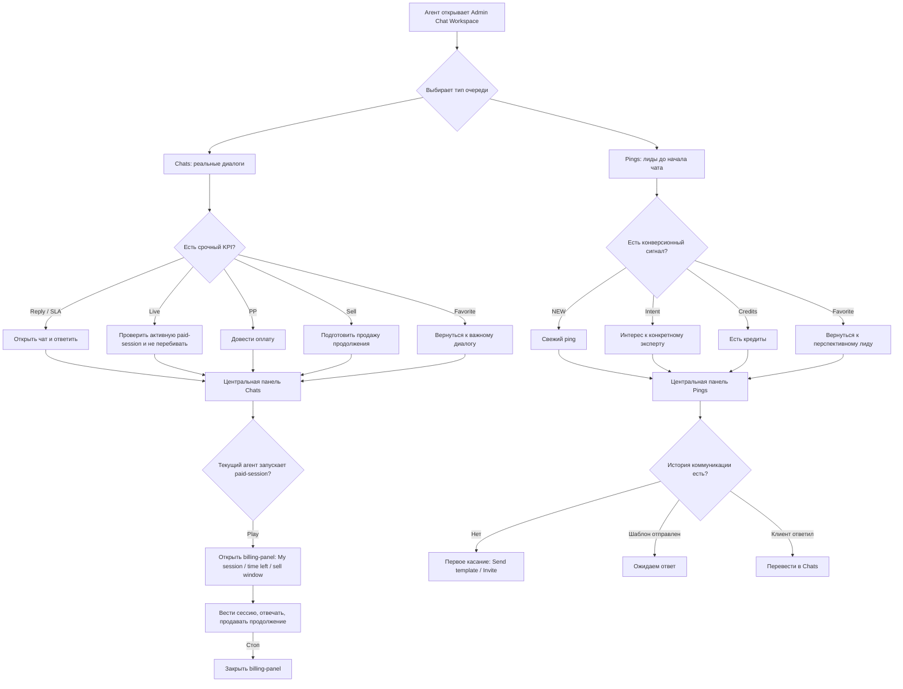

# Admin Chat Workspace: бизнес-логика Chats и Pings

Документ описывает рабочую логику экрана для агента. Основное правило: экран не показывает пустые отрицательные состояния вроде `No live session`, `No active chat`, `No credits`. Индикатор выводится только если он сообщает наличие действия, риска, интереса, оплаты, активной сессии или ручной отметки.

В текущей версии макет очищен от слабых сигналов: нет процента потери клиента без утвержденной модели, нет generic quick replies, нет follow-up сценариев без `due_at/reason/owner`, нет точного LTV как факта при отсутствии подтвержденной формулы. Каждый видимый элемент должен объяснять текущий stage, деньги, риск или следующий допустимый шаг.

## Workflow layer

После анализа конкурентного обучения экран должен вести не просто список сообщений, а рабочую воронку:

`free reading -> intrigue -> Book Now -> objection/payment -> paid session -> extension/reactivation`

Важное разделение:

- `conversation.stage` — бизнес-стадия диалога.
- `direct/reply/edit` — режим отправки сообщения в composer.
- `Chats/Pings` — режимы рабочей очереди.

Эти три слоя нельзя смешивать. Стадия влияет на подсказки, ограничения, правую панель и приоритет, но не становится четвертым режимом composer и не заменяет `Chats/Pings`.

| Stage | Что означает | Что должен видеть эксперт |
|---|---|---|
| `free_reading` | Идет ограниченный бесплатный ответ | Сколько insight уже дано и где граница бесплатной ценности |
| `intrigue_ready` | Достаточно контекста, пора вести к Book Now | Конкретный следующий шаг к Book Now |
| `book_now_sent` | Book Now уже отправлен | Не раскрывать новую платную ценность бесплатно |
| `post_book_now_objection` | Клиент не оплатил и тянет/возражает | Тип objection, число попыток, возврат к Book Now |
| `paid_session_booked_future` | Будущая paid session оплачена/забронирована | Контент будущей сессии заблокирован до старта |
| `paid_session_active` | Идет оплаченная сессия | Timer, promised topics, message rhythm, idle risk |
| `extension_offer` | Новая тема не помещается в текущую оплату | Продление/новая сессия вместо бесплатного раскрытия |
| `reactivation_due` / `reactivation_active` | Возврат buyer/strong-intent клиента | Reason for return -> intrigue -> Book Now |
| `safety_escalation` | Риск самоповреждения/claim/legal | Sales hints suppressed, safety/support path |

Минимум UI:

- stage badge в левой очереди;
- stage chip в header;
- `Workflow` block в правой панели;
- stage-aware composer hint;
- Book Now / paid session / objection / ping reason / safety fields в data-contract.

Ограничения доказательности:

- точные формулы pay/bonus/efficiency не выводятся в этот экран как факт;
- coupon eligibility остается backend/business-rule решением;
- safety copy должна быть утверждена отдельно, UI только показывает suppress-sales/escalation state.

## Chats

`Chats` — реальные активные диалоги между клиентом и экспертом. Задача: быстро выбрать диалог, который требует действия сейчас, и дальше вести переписку, платную сессию или продажу продолжения.

| Область | Элемент | Что показывает | Как работает | Зачем нужен |
|---|---|---|---|---|
| Левая | `Reply` | Клиент ждет ответа | Появляется, если последнее значимое сообщение пришло от клиента и после него еще нет ответа агента | Быстро понять, кому нужно ответить |
| Левая | `SLA` | Клиент ждет дольше допустимого времени | Появляется, если ожидание ответа превысило SLA-порог | Спасти KPI, снизить риск жалобы или потери клиента |
| Левая | `Live` | У клиента идет активная платная сессия | Появляется, если по клиенту/чату есть активная paid-session | Видеть платный приоритет и не вмешиваться случайно |
| Левая | `PP` | Клиент открыл оплату, но платеж не завершен | Появляется, если payment flow связан с текущим клиентом, экспертом, оффером или диалогом | Довести клиента до завершения платежа |
| Левая | `Sell` | Есть задача продажи или продления | Появляется, если клиент готов к продолжению, подходит момент продажи или есть открытый sell-сценарий | Не упустить коммерческую возможность |
| Левая | unread counter | Количество непрочитанных сообщений | Считает непрочитанные сообщения в конкретном чате | Оценить объем входящих сообщений |
| Левая | красный unread | Новое недавнее сообщение | Подсвечивает счетчик, если входящее сообщение свежее и еще не обработано | Быстро заметить новый входящий без отдельного тега `NEW` |
| Левая | `Favorite` | Чат добавлен в избранное | Агент вручную добавляет чат в избранное | Быстро вернуться к важному диалогу |
| Левая | фильтр `Reply` | Чаты, где клиент ждет ответа | Отбирает чаты с активным `Reply` | Собрать очередь на ответ |
| Левая | фильтр `SLA` | Чаты с риском просрочки ожидания | Отбирает чаты с активным `SLA` | Сфокусироваться на рисковых диалогах |
| Левая | фильтр `Live` | Чаты с активной paid-session | Отбирает чаты с активным `Live` | Контролировать платные сессии |
| Левая | фильтр `PP` | Чаты с незавершенной оплатой | Отбирает чаты с payment pending по текущему контексту | Довести клиента до завершения платежа |
| Левая | фильтр `Sell` | Чаты с задачей продажи/продления | Отбирает чаты с активным sell-сценарием | Сфокусироваться на коммерческих возможностях |
| Левая | фильтр `Favorite` | Чаты, добавленные в избранное | Отбирает чаты, вручную отмеченные агентом | Вернуться к важным диалогам |
| Левая | фильтр `Archive` | Архивные чаты | Показывает чаты, убранные из рабочей очереди | Посмотреть обработанные или временно убранные диалоги |
| Центральная | клиент -> эксперт | Между кем открыт диалог | Показывает клиента и экспертный профиль в открытом чате | Агент понимает контекст общения |
| Центральная | `Live` сверху | Клиент уже в активной paid-session | Показывается, если paid-session активна, даже если ее ведет другой эксперт | Предупредить другого эксперта не перебивать |
| Центральная | `PP` сверху | Клиент открыл оплату, но платеж не завершен | Показывается только если оплата связана с текущим клиентом/экспертом/оффером/диалогом | Контролировать незавершенную оплату |
| Центральная | `Sell sent` | Оффер уже отправлен | Появляется после отправки предложения продолжения | Не дублировать продажу слишком часто |
| Центральная | `Last activity` | Последняя активность в диалоге | Показывает время последнего события | Понять свежесть ситуации без лишних тегов |
| Центральная | `Pinned` | Диалог закреплен | Агент закрепляет открытый чат | Быстро вернуться к важному открытому диалогу |
| Центральная | Play / `Стоп` | Старт и остановка моей paid-session | Play открывает billing-panel; `Стоп` закрывает billing-panel | Управлять текущей платной сессией |
| Центральная | `My session` | Платную сессию ведет текущий агент | Появляется только после клика Play текущим агентом | Отличить мою сессию от чужого `Live` сверху |
| Центральная | `14m left` | Остаток оплаченного времени | Считается как paid duration минус elapsed time | Планировать глубину ответа |
| Центральная | `Sell window 4m` | Момент уместной продажи продления | Формируется по остатку времени, длительности сессии, cooldown после прошлого оффера, состоянию ответа и запрету `No push` | Не упустить продажу, но не давить слишком рано |
| Центральная | `RU -> EN` | Направление перевода | Берется из языка клиента и языка работы оператора/эксперта | Техническая подсказка, поэтому стоит последней |
| Центральная | `Подсказка продажи` | Короткая рекомендация по сессии | Зависит от состояния paid-session и sell-window | Напомнить: сначала закрыть основной вопрос, потом предлагать продолжение |
| Центральная | `Need data` | Запрос недостающих данных | Быстро готовит сообщение с просьбой уточнить дату/время рождения, timezone или детали вопроса | Продолжить консультацию корректно |
| Центральная | `Sell` / `Offer` | Продажа продолжения | Открывает варианты продажи минут, пакета или глубокого разбора | Упростить коммерческое действие |
| Центральная | `No push` | Запрет давления продажей | Используется в чувствительной ситуации, при раздражении клиента или риске жалобы | Не сломать доверие клиента |
| Центральная | `Comp request` | Запрос компенсации | Используется при сбое, спорной ситуации или платежной проблеме | Передать кейс на ручную проверку |
| Центральная | `Resolve` | Завершение рабочего диалога | Отмечает чат как решенный | Убрать завершенный кейс из активной нагрузки |
| Правая | `Client` | Паспорт клиента | Язык, кредиты, дата/время рождения, timezone, устройство, эксперт | Дать подробный контекст без перегруза очереди |
| Правая | `Workflow` | Stage, Book Now, paid session, objection, ping/lift, risk, короткий draft | Заполняется из `data-conversation-stage` и workflow-полей выбранной карточки | Дает эксперту бизнес-контекст до отправки ответа |
| Правая | `Pay` | Баланс, paid status, paid history, coupon rule, extend window, платежи, offer | Собирает платежную и коммерческую информацию | Помогает продавать и контролировать оплаты без неподтвержденной точности |
| Правая | `Notes` | Внутренние заметки | Приватные заметки команды по клиенту | Сохранить рабочий контекст |

## Pings

`Pings` — лиды/сигналы интереса до начала полноценного чата. Задача: найти перспективного клиента, который проявил интерес именно к конкретному эксперту, и мягко перевести интерес в первый диалог.

| Область | Элемент | Что показывает | Как работает | Зачем нужен |
|---|---|---|---|---|
| Левая | `NEW` | Новый сигнал интереса | Появляется, если ping создан недавно и еще не обработан | Быстро увидеть свежего лида |
| Левая | `Intent` | Интерес к конкретному эксперту | Появляется, если клиент смотрел профиль эксперта, услуги, цену, возвращался, нажимал start/chat/payment именно по этому эксперту | Понять, что лид теплый, а не случайный |
| Левая | `Credits` | У клиента есть кредиты | Появляется, если баланс клиента достаточен для старта платного общения | Выбрать лида с большей вероятностью конверсии |
| Левая | unread / `!` | Ping требует внимания | Показывается на свежем необработанном сигнале | Визуально подсветить важный лид |
| Левая | `Favorite` | Ping добавлен в избранное | Агент вручную добавляет ping в избранное | Вернуться к перспективному лиду |
| Левая | фильтр `NEW` | Новые pings | Отбирает свежие необработанные сигналы | Быстро обработать новые лиды |
| Левая | фильтр `Credits` | Лиды с кредитами | Отбирает pings, где у клиента есть достаточный баланс | Найти лидов с шансом платного старта |
| Левая | фильтр `Intent` | Лиды с интересом к конкретному эксперту | Отбирает pings с expert-specific intent | Сфокусироваться на теплых лидах |
| Левая | фильтр `Favorite` | Pings, добавленные в избранное | Отбирает pings, вручную отмеченные агентом | Быстро вернуться к перспективным лидам |
| Центральная | `NEW` | Свежий ping | Показывается, если сигнал новый и актуальный | Понять срочность первого касания |
| Центральная | `Intent` | Интерес к конкретному эксперту | Показывается при expert-specific действиях клиента | Понять, почему лид перспективный |
| Центральная | `Credits` | У клиента есть кредиты | Показывается при достаточном балансе | Оценить шанс конверсии |
| Центральная | `Первое касание` | История коммуникации пустая | Показывается, если агент еще не писал клиенту | Подсказать мягкий старт |
| Центральная | `Ожидаем ответ` | Касание уже было, клиент еще не ответил | Используется после отправки шаблона | Не писать повторно слишком рано |
| Центральная | `Send template` | Вставить мягкое первое сообщение | Доступно, если истории еще нет | Начать контакт без давления |
| Центральная | `Invite` | Мягко пригласить в чат/платное общение | Используется при `Intent` или `Credits`; варианты зависят от причины интереса | Конвертировать интерес в диалог |
| Центральная | `Favorite` | Добавить ping в избранное | Ручное действие агента | Вернуться к перспективному лиду позже |
| Центральная | `Dismiss` | Убрать ping из рабочей очереди | Используется, если лид неактуален или обработан | Не засорять очередь |
| Правая | `Client` | Паспорт клиента | Язык, кредиты, регистрация, устройство, город | Понять, кто клиент |
| Правая | `Workflow` | Stage, summary, next action, outreach draft | Workflow предлагает мягкий сценарий касания, но учитывает стадию, previous buyer, lift и safety | Помочь начать коммуникацию без давления |
| Правая | `Pay` | Кредиты, платежная готовность, подходящий пакет | Собирает коммерческий контекст лида | Понять, как конвертировать интерес |
| Правая | `Notes` | Внутренние заметки | Приватные заметки по лиду | Сохранить контекст для будущей обработки |

## User Flow

## Правила отображения

| Правило | Как работает |
|---|---|
| `Chats` и `Pings` не смешиваются | У каждого режима свои KPI-сигналы, фильтры и быстрые действия |
| Левая область отвечает за приоритет | Там только то, что помогает выбрать следующий объект |
| Центр отвечает за текущую работу | В `Chats` это диалог и paid-session; в `Pings` это первое касание и конверсия лида |
| Правая область отвечает за детали | Паспорт клиента, платежи, AI, заметки, follow-up |
| Отрицательные состояния не выводятся | Не показываем `No live session`, `No active chat`, `No credits`, `No chat yet` |
| `Intent` всегда expert-specific | Это интерес к конкретному эксперту, а не общая активность клиента на платформе |
| `PP` показывается только при привязке | Pending-оплата должна быть связана с текущим клиентом, экспертом, оффером или диалогом |
